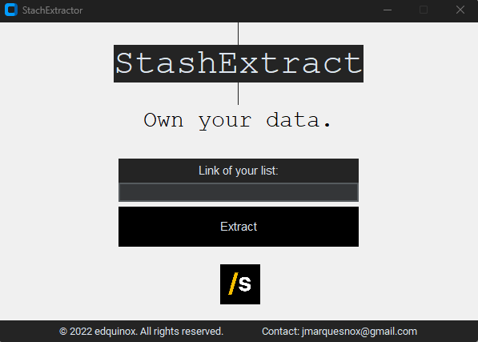

# StashExtract_GUI

## Description
StashExtract_GUI is a graphical user interface (GUI) application for extracting data from [stash](https://stash.games/), including lists and reviews.
It is built using Python and utilizes various libraries and frameworks such as tkinter for the GUI, selenium for making HTTP requests, and BeautifulSoup for parsing HTML.

## Features
- User-friendly interface for easy navigation and interaction
- Ability to extract your data from [stash](https://stash.games/)
- Progress tracking during the extraction process
- Error handling and notifications for any issues encountered

## Installation
1. Clone the repository: `git clone https://github.com/EdEquinox/StashExtract_GUI.git`
2. Install Python `pip install python`
3. Install the required dependencies: `pip install -r requirements.txt`
4. Start the application: `python -m stashextract`

## Standalone app
- Download link: 

## Usage
1. Launch the application.
2. Copy the link of the data you want to extract.
3. Click the "Extract" button to initiate the extraction process.
4. Monitor the progress and wait for the extraction to complete.
5. Once the extraction is finished, the extracted file will be available in the specified output directory.

## Contributing
Contributions are welcome! If you would like to contribute to this project, please follow these steps:
1. Fork the repository.
2. Create a new branch: `git checkout -b feature/your-feature`
3. Make your changes and commit them: `git commit -m 'Add your feature'`
4. Push to the branch: `git push origin feature/your-feature`
5. Submit a pull request.

## License
This project is licensed under the [MIT License](LICENSE).

## Contact
For any questions or inquiries, please contact jmarquesnox@gmail.com.
